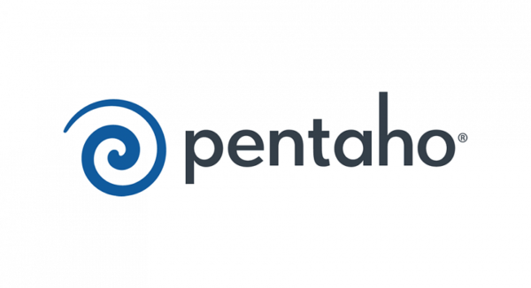

# Seguro Altavista Project

It is Business Inteligence Solution making a OLTP and OLAP project inlcuding the [ETL](https://www.ibm.com/topics/etl) (Extraction Transformation and Load) of the data and Visualization of each data in a preview made in [PowerBi](https://www.microsoft.com/en-us/power-platform/products/power-bi) of a Insurance company.

This project was developed guided with the professor Concettina Di Vasta in the subject "Inteigencia de Negocios" at the ["Universidad Catolica Andres Bello"](https://www.ucab.edu.ve/)

  

## Developers
<table align="center">
    <tbody>
        <tr>
            <td align="center"><a href="https://github.com/Fussita" rel="nofollow"> <b>Fussita</b></a> <a href="" title="Commits"><g-emoji class="g-emoji" alias="book" fallback-src="https://github.githubassets.com/images/icons/emoji/unicode/1f4d6.png">📖</g-emoji></a></td>
            <td align="center"><a href="https://github.com/C102002" rel="nofollow"> <b>Alfredo Fung</b></a> <a href="" title="Commits"><g-emoji class="g-emoji" alias="book" fallback-src="https://github.githubassets.com/images/icons/emoji/unicode/1f4d6.png">📖</g-emoji></a></td>
            <td align="center"><a href="https://github.com/DanielBortot" rel="nofollow"> <b>Daniel Borot</b></a> <a href="" title="Commits"><g-emoji class="g-emoji" alias="book" fallback-src="https://github.githubassets.com/images/icons/emoji/unicode/1f4d6.png">📖</g-emoji></a></td>
        </tr>
    </tbody>
</table>

## Topic

## First sprint

To the first sprint we needed to develop a Datamart made in base of the OLTP ER [(Entity–relationship model)](https://www.geeksforgeeks.org/introduction-of-er-model/).

### OLTP ER

### OLAP ER (Datamart)

## Second sprint

To the second sprint we needed to develop the [ETL](https://www.ibm.com/topics/etl) and Inserts to populate the database so the elemets could change and see the analisis and metrics of the second sprint in [PowerBi](https://www.microsoft.com/en-us/power-platform/products/power-bi).

### Pentaho Data Integration

  

### Power Bi

  

### Final result

  </a>

## Requirements

<table align="center">
    <tbody>
        <tr>
            <td align="center"> <a href="https://docs.nestjs.com" rel="nofollow">  <b>NestJS</b></a> <a href="https://docs.nestjs.com" title="Commits"><g-emoji class="g-emoji" alias="book" fallback-src="https://github.githubassets.com/images/icons/emoji/unicode/1f4d6.png">📖</g-emoji></a></td>
            <td align="center"> <a href="https://nodejs.org/docs/latest/api/" rel="nofollow">  <b>NodeJS</b></a> <a href="https://docs.nestjs.com" title="Commits"><g-emoji class="g-emoji" alias="book" fallback-src="https://github.githubassets.com/images/icons/emoji/unicode/1f4d6.png">📖</g-emoji></a></td>
            <td align="center"> <a href="https://docs.docker.com" rel="nofollow">  <b>Docker</b></a> <a href="https://docs.docker.com" title="Commits"><g-emoji class="g-emoji" alias="book" fallback-src="https://github.githubassets.com/images/icons/emoji/unicode/1f4d6.png">📖</g-emoji></a></td>
            <td align="center"> <a href="https://www.microsoft.com/en-us/power-platform/products/power-bi" rel="nofollow">  <b>PowerBi</b></a> <a href="https://www.microsoft.com/en-us/power-platform/products/power-bi" title="Commits"><g-emoji class="g-emoji" alias="book" fallback-src="https://github.githubassets.com/images/icons/emoji/unicode/1f4d6.png">📖</g-emoji></a></td>
        </tr>
    </tbody>
</table>

